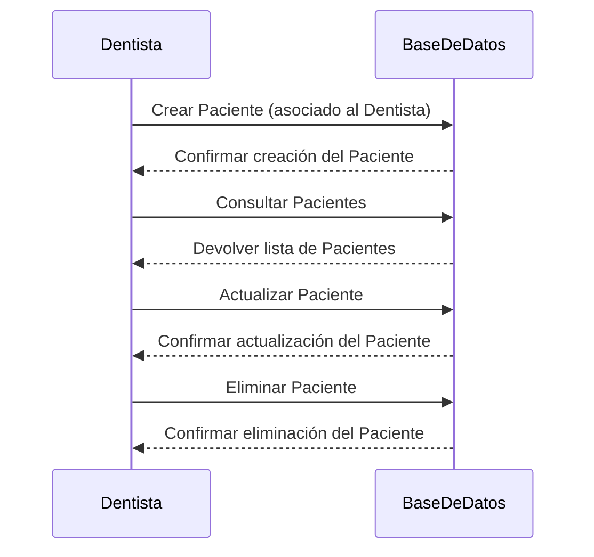

```mermaid
sequenceDiagram
    participant Dentista
    participant BaseDeDatos

    Dentista->>BaseDeDatos: Crear Paciente (asociado al Dentista)
    BaseDeDatos-->>Dentista: Confirmar creación del Paciente

    Dentista->>BaseDeDatos: Consultar Pacientes
    BaseDeDatos-->>Dentista: Devolver lista de Pacientes

    Dentista->>BaseDeDatos: Actualizar Paciente
    BaseDeDatos-->>Dentista: Confirmar actualización del Paciente

    Dentista->>BaseDeDatos: Eliminar Paciente
    BaseDeDatos-->>Dentista: Confirmar eliminación del Paciente
```