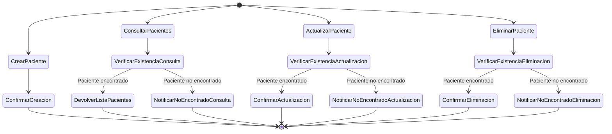

```mermaid
stateDiagram-v2
    [*] --> CrearPaciente
    CrearPaciente --> ConfirmarCreacion
    ConfirmarCreacion --> [*]

    [*] --> ConsultarPacientes
    ConsultarPacientes --> VerificarExistenciaConsulta
    VerificarExistenciaConsulta --> DevolverListaPacientes : Paciente encontrado
    VerificarExistenciaConsulta --> NotificarNoEncontradoConsulta : Paciente no encontrado
    DevolverListaPacientes --> [*]
    NotificarNoEncontradoConsulta --> [*]

    [*] --> ActualizarPaciente
    ActualizarPaciente --> VerificarExistenciaActualizacion
    VerificarExistenciaActualizacion --> ConfirmarActualizacion : Paciente encontrado
    VerificarExistenciaActualizacion --> NotificarNoEncontradoActualizacion : Paciente no encontrado
    ConfirmarActualizacion --> [*]
    NotificarNoEncontradoActualizacion --> [*]

    [*] --> EliminarPaciente
    EliminarPaciente --> VerificarExistenciaEliminacion
    VerificarExistenciaEliminacion --> ConfirmarEliminacion : Paciente encontrado
    VerificarExistenciaEliminacion --> NotificarNoEncontradoEliminacion : Paciente no encontrado
    ConfirmarEliminacion --> [*]
    NotificarNoEncontradoEliminacion --> [*]
```