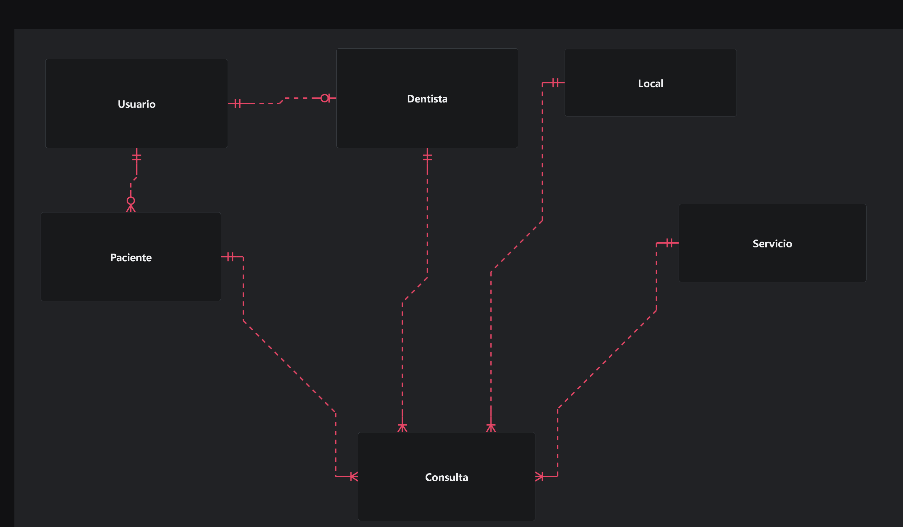
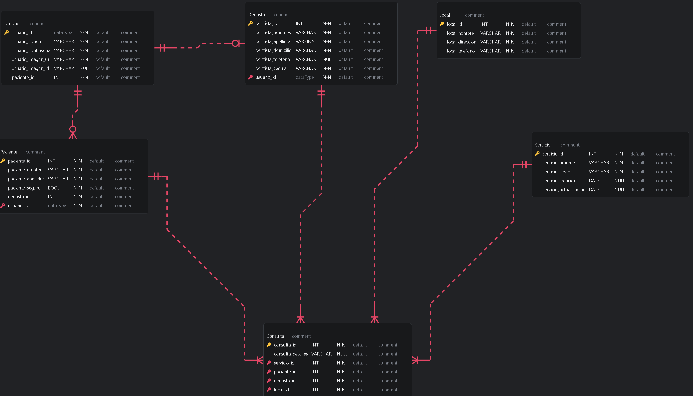

# Normalización de Bases de Datos

Es el proceso de organizar los datos de una base de datos. Esto incluye la creación de tablas y el establecimiento de relaciones entre ellas, siguiendo reglas diseñadas para proteger los datos y mejorar la flexibilidad de la base, eliminando redundancias y dependencias incoherentes.
  
### Importancia  
Minimizar datos redundantes previene el desperdicio de espacio en disco y reduce problemas de mantenimiento. Además, evita inconsistencias en la actualización de datos distribuidos en múltiples ubicaciones.

# Reglas de Normalización.
| Forma Normal                   | Descripción                                                                                                           |
| ------------------------------ | --------------------------------------------------------------------------------------------------------------------- |
| **Primera Forma Normal (1NF)** | Elimina grupos repetidos, separa cada conjunto de datos en una tabla independiente y utiliza una clave principal.       |
| **Segunda Forma Normal (2NF)** | Crea tablas independientes para datos recurrentes y establece relaciones mediante claves externas, partiendo de la 1NF. |
| **Tercera Forma Normal (3NF)** | Elimina datos que dependen de atributos que no son la clave principal, reduciendo redundancias adicionales.             |

## Ejemplo de Normalización de una Tabla de Alumnos

### Tabla Original (Sin Normalizar)

| Nº alumno | Tutor  | Despacho-Tut | Clase1 | Clase2  | Clase3  |
|-----------|--------|--------------|--------|---------|---------|
| 1022      | García | 412          | 101-07 | 143-01  | 159-02  |
| 4123      | Díaz   | 216          | 101-07 | 143-01  | 179-04  |

### Primera Forma Normal (1NF)

| Nº alumno | Tutor  | Despacho-Tut | Nº clase |
|-----------|--------|--------------|----------|
| 1022      | García | 412          | 101-07   |
| 1022      | García | 412          | 143-01   |
| 1022      | García | 412          | 159-02   |
| 4123      | Díaz   | 216          | 101-07   |
| 4123      | Díaz   | 216          | 143-01   |
| 4123      | Díaz   | 216          | 179-04   |

### Segunda Forma Normal (2NF)

**Tabla Alumnos:**

| Nº alumno | Tutor  | Despacho-Tut |
|-----------|--------|--------------|
| 1022      | García | 412          |
| 4123      | Díaz   | 216          |

**Tabla Registro de Clases:**

| Nº alumno | Nº clase |
|-----------|----------|
| 1022      | 101-07   |
| 1022      | 143-01   |
| 1022      | 159-02   |
| 4123      | 101-07   |
| 4123      | 143-01   |
| 4123      | 179-04   |

### Tercera Forma Normal (3NF)

**Tabla Alumnos:**

| Nº alumno | Tutor  |
|-----------|--------|
| 1022      | García |
| 4123      | Díaz   |

**Tabla Personal:**

| Nombre  | Sala | Dept. |
|---------|------|-------|
| García  | 412  | 42    |
| Díaz    | 216  | 42    |

## Cuarta Forma Normal (4FN)

Una entidad se encuentra en la Cuarta Forma Normal si ninguna de sus instancias contiene dos o más hechos de valores múltiples independientes sobre la misma entidad. Esto significa que si una entidad tiene, por ejemplo, dos atributos (como SKILL_CODE y LANGUAGE_CODE) que permiten almacenar múltiples valores de manera independiente, la entidad violará la 4FN al mezclar ambas relaciones en una sola tabla.

**Ejemplo:**

Supongamos la entidad `EMPLOYEE` que incluye los atributos:
- `EMPLOYEE_ID`
- `SKILL_CODE` (para representar las habilidades del empleado)
- `LANGUAGE_CODE` (para representar los idiomas que conoce)

Si un empleado puede tener varias habilidades y varios idiomas, el hecho de almacenar ambas relaciones en una única entidad puede producir redundancias e inconsistencias. Para cumplir con la 4FN, se deben separar estas relaciones en dos entidades:

1. **Empleado-Habilidades:** Con una clave compuesta de `EMPLOYEE_ID` y `SKILL_CODE`.
2. **Empleado-Idiomas:** Con una clave compuesta de `EMPLOYEE_ID` y `LANGUAGE_CODE`.

Esto elimina las dependencias multiplas independientes.  
*Nota:* Si los hechos son interdependientes (por ejemplo, ciertas habilidades se asocian únicamente a determinados idiomas), no se debe dividir la entidad, ya que los valores están relacionados.

Al organizar los datos de esta manera, se asegura que la estructura de la base de datos esté libre de redundancias y se facilite el mantenimiento.  
  

## Referencias.
- Microsoft. (2024, 6 de junio). Fundamentos de la normalización de bases de datos. Microsoft Learn. https://learn.microsoft.com/es-es/office/troubleshoot/access/database-normalization-description
- IBM. (n.d.). Modeling normalization in database design. Retrieved February 20, 2025, from https://www.ibm.com/docs/es/db2-for-zos/13?topic=modeling-normalization-in-database-design


# Aplicando normalización en sistema dentista.

## 1NF
Cada tabla tiene una clave primaria y todas las columnas contienen valores atómicos, sin grupos repetidos.

## 2NF
Todas las tablas usan claves simples, cada atributo no clave depende completamente de la clave primaria de su tabla.

# 3F
No hay dependencias transitivas en la estructura; las relaciones entre entidades se gestionan mediante claves foráneas.

## Relaciones de la base de datos.



## Estructura de la base de datos.


## Código SQL de la base de datos.

```sql
CREATE TABLE Consulta
(
  consulta_id       INT     NOT NULL,
  consulta_detalles VARCHAR NULL    ,
  servicio_id       INT     NOT NULL,
  paciente_id       INT     NOT NULL,
  dentista_id       INT     NOT NULL,
  local_id          INT     NOT NULL,
  PRIMARY KEY (consulta_id)
);

CREATE TABLE Dentista
(
  dentista_id        INT       NOT NULL,
  dentista_nombres   VARCHAR   NOT NULL,
  dentista_apellidos VARBINARY NOT NULL,
  dentista_domicilio VARCHAR   NOT NULL,
  dentista_telefono  VARCHAR   NULL    ,
  dentista_cedula    VARCHAR   NOT NULL,
  usuario_id                   NOT NULL,
  PRIMARY KEY (dentista_id)
);

CREATE TABLE Local
(
  local_id        INT     NOT NULL,
  local_nombre    VARCHAR NOT NULL,
  local_direccion VARCHAR NOT NULL,
  local_telefono  VARCHAR NOT NULL,
  PRIMARY KEY (local_id)
);

CREATE TABLE Paciente
(
  paciente_id        INT     NOT NULL,
  paciente_nombres   VARCHAR NOT NULL,
  paciente_apellidos VARCHAR NOT NULL,
  paciente_seguro    BOOL    NOT NULL,
  dentista_id        INT     NOT NULL,
  usuario_id                 NOT NULL,
  PRIMARY KEY (paciente_id)
);

CREATE TABLE Servicio
(
  servicio_id            INT     NOT NULL,
  servicio_nombre        VARCHAR NOT NULL,
  servicio_costo         VARCHAR NOT NULL,
  servicio_creacion      DATE    NULL    ,
  servicio_actualizacion DATE    NULL    ,
  PRIMARY KEY (servicio_id)
);

CREATE TABLE Usuario
(
  usuario_id                 NOT NULL,
  usuario_correo     VARCHAR NOT NULL,
  usuario_contrasena VARCHAR NOT NULL,
  usuario_imagen_url VARCHAR NOT NULL,
  usuario_imagen_id  VARCHAR NULL    ,
  paciente_id        INT     NOT NULL,
  PRIMARY KEY (usuario_id)
);

ALTER TABLE Consulta
  ADD CONSTRAINT FK_Servicio_TO_Consulta
    FOREIGN KEY (servicio_id)
    REFERENCES Servicio (servicio_id);

ALTER TABLE Paciente
  ADD CONSTRAINT FK_Usuario_TO_Paciente
    FOREIGN KEY (usuario_id)
    REFERENCES Usuario (usuario_id);

ALTER TABLE Dentista
  ADD CONSTRAINT FK_Usuario_TO_Dentista
    FOREIGN KEY (usuario_id)
    REFERENCES Usuario (usuario_id);

ALTER TABLE Consulta
  ADD CONSTRAINT FK_Paciente_TO_Consulta
    FOREIGN KEY (paciente_id)
    REFERENCES Paciente (paciente_id);

ALTER TABLE Consulta
  ADD CONSTRAINT FK_Dentista_TO_Consulta
    FOREIGN KEY (dentista_id)
    REFERENCES Dentista (dentista_id);

ALTER TABLE Consulta
  ADD CONSTRAINT FK_Local_TO_Consulta
    FOREIGN KEY (local_id)
    REFERENCES Local (local_id);

```