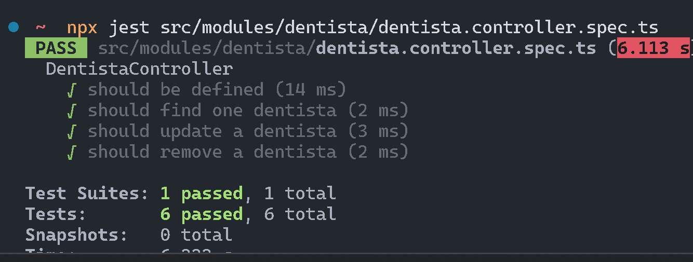

# Pruebas a realizar en el backend usando NestJS y Jest

## Pruebas Unitarias
Las pruebas unitarias son esenciales para verificar la funcionalidad de las unidades más pequeñas de código. Utilizando Jest, se realizarán las siguientes pruebas unitarias en el backend de NestJS:

- **Verificación de lógica de negocio**: Asegurar que las funciones y métodos implementen correctamente la lógica de negocio.
- **Pruebas de límites**: Verificar que las funciones manejen correctamente los valores en los límites de sus entradas.
- **Manejo de errores**: Asegurar que las funciones manejen adecuadamente las excepciones y errores.
- **Pruebas orientadas a objetos**: Verificar que las clases y sus métodos funcionen correctamente y que las dependencias sean inyectadas adecuadamente.

## Pruebas de Integración
Las pruebas de integración aseguran que los diferentes módulos y servicios del backend funcionen correctamente juntos. Utilizando Jest y Supertest, se realizarán las siguientes pruebas de integración:

- **Interacción entre módulos**: Verificar que los módulos del backend interactúen correctamente entre sí.
- **Comunicación con la base de datos**: Asegurar que las operaciones de lectura y escritura en la base de datos se realicen correctamente.
- **Servicios externos**: Verificar que las integraciones con servicios externos funcionen como se espera.

## Pruebas End-to-End (E2E)
Las pruebas E2E aseguran que el sistema completo funcione correctamente desde el punto de vista del usuario final. Utilizando Jest y Supertest, se realizarán las siguientes pruebas E2E:

- **Flujos de usuario**: Verificar que los flujos de usuario principales funcionen correctamente.
- **Autenticación y autorización**: Asegurar que los procesos de autenticación y autorización funcionen correctamente.
- **Validación de entradas**: Verificar que las entradas del usuario sean validadas correctamente y que se manejen adecuadamente los errores.

## Pruebas de Caja Blanca
Las pruebas de caja blanca se enfocan en la estructura interna del código. Utilizando Jest, se realizarán las siguientes pruebas de caja blanca:

- **Cobertura de código**: Asegurar que todas las rutas de código sean ejecutadas durante las pruebas.
- **Verificación de ramas**: Verificar que todas las ramas de condiciones lógicas sean probadas.
- **Pruebas de bucles**: Asegurar que los bucles se ejecuten correctamente y manejen adecuadamente los casos de borde.

## Herramientas y Configuración
NestJS facilita la configuración y ejecución de pruebas mediante las siguientes características:

- **Scaffolding automático**: NestJS genera automáticamente pruebas unitarias y E2E por defecto.
- **Integración con Jest y Supertest**: NestJS proporciona integración lista para usar con Jest y Supertest.
- **Inyección de dependencias**: El sistema de inyección de dependencias de NestJS está disponible en el entorno de pruebas para facilitar el mocking de componentes.

Estas pruebas ayudarán a asegurar la calidad y el correcto funcionamiento del backend desarrollado con NestJS.

## Ejemplo de prueba unitaria en el controlador Denitista
```typescript
import { Test, TestingModule } from '@nestjs/testing';
import { DentistaController } from './dentista.controller';
import { DentistaService } from './dentista.service';
import { CreateDentistaDto } from './dto/create-dentista.dto';
import { UpdateDentistaDto } from './dto/update-dentista.dto';

describe('DentistaController', () => {
  let controller: DentistaController;
  let service: DentistaService;

  beforeEach(async () => {
    const module: TestingModule = await Test.createTestingModule({
      controllers: [DentistaController],
      providers: [
        {
          provide: DentistaService,
          useValue: {
            create: jest.fn().mockResolvedValue('created'),
            findAll: jest.fn().mockResolvedValue('all'),
            findOne: jest.fn().mockResolvedValue('one'),
            update: jest.fn().mockResolvedValue('updated'),
            remove: jest.fn().mockResolvedValue('removed'),
          },
        },
      ],
    }).compile();

    controller = module.get<DentistaController>(DentistaController);
    service = module.get<DentistaService>(DentistaService);
  });

  it('should be defined', () => {
    expect(controller).toBeDefined();
  });

  it('should create a dentista', async () => {
    const dto = new CreateDentistaDto();
    expect(await controller.create(dto)).toBe('created');
    expect(service.create).toHaveBeenCalledWith(dto);
  });

  it('should find all dentistas', async () => {
    expect(await controller.findAll()).toBe('all');
    expect(service.findAll).toHaveBeenCalled();
  });

  it('should find one dentista', async () => {
    const id = '1';
    expect(await controller.findOne(id)).toBe('one');
    expect(service.findOne).toHaveBeenCalledWith(+id);
  });

  it('should update a dentista', async () => {
    const id = '1';
    const dto = new UpdateDentistaDto();
    expect(await controller.update(id, dto)).toBe('updated');
    expect(service.update).toHaveBeenCalledWith(+id, dto);
  });

  it('should remove a dentista', async () => {
    const id = '1';
    expect(await controller.remove(id)).toBe('removed');
    expect(service.remove).toHaveBeenCalledWith(+id);
  });
});
``` 

